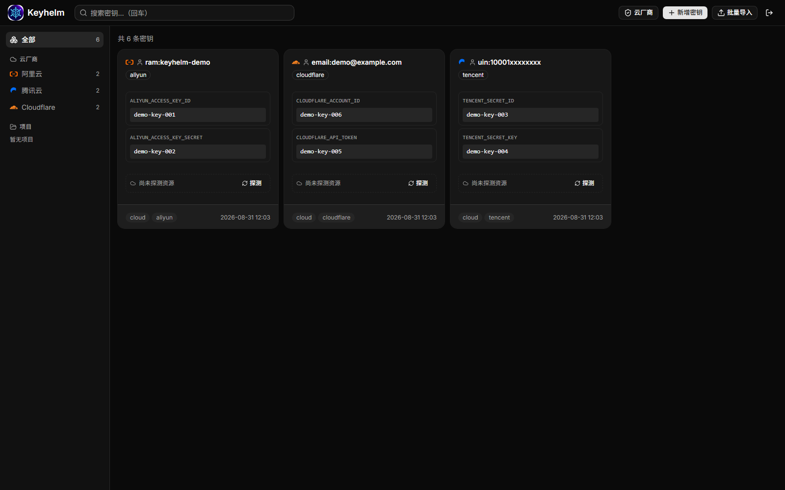

<div align="center">


# Keyhelm — Secret Configuration Center in Rust

A unified secret manager that aggregates API keys and credentials scattered across your
servers (docker-compose / .env / config.yaml). Secrets are encrypted with **AES-256-GCM**
under a master key before hitting the database, and are served through a **REST API**
(for AI / bots) and a **Web UI** (for humans to browse & copy).

**English | [中文](README.md)**

</div>

<div align="center">


[](https://github.com/limitcool/keyhelm/releases)

</div>

## Features

- **Dual storage**: SQLite (default) / PostgreSQL (config switch)
- **Encryption**: AES-256-GCM, 32-byte master key (env or file), DB stores ciphertext only
- **Auth**: JWT (HS256). Web login gives an HttpOnly cookie; programs exchange an API key for a JWT
- **API**: CRUD / reveal / resolve (batch fetch for AI) / import (batch upsert for AI) / collections / audit log
- **Web UI**: project tree + search + **reveal plaintext in place** + one-click copy per row (clipboard needs HTTPS / localhost)
- **Cloud provider grouping**: sidebar groups by Aliyun / Tencent / Google Cloud / Cloudflare, etc.; new secrets auto-suggest the provider
- **Project categories + custom icons**: sidebar projects grouped by AI / infra / auth / apps / monitoring, collapsible; pick a lucide icon when creating a project (stored on the backend, open-source friendly)
- **Cloud integration**: validate key validity against cloud APIs + probe reachable resources (Aliyun STS / Tencent STS / Cloudflare / Google service account)
- **Import tool**: aggregate secrets from `docker-stacks/*/docker-compose.yaml`, `/root/.secrets/*.env`, and per-service `config.yaml`

## Screenshot



> The screenshot is from a local demo instance (only the `aliyun` / `tencent` / `cloudflare` example projects; all values are `demo-key-*` placeholders, not real credentials).

## Quick Start (local)

```bash
# 1. Copy config
cp config.example.yaml config.yaml

# 2. Generate a master key (or set KEYHELM_MASTER_KEY env)
keyhelm gen-key --out data/master.key

# 3. First run prints an admin password + admin token (printed once — save it)
keyhelm serve

# 4. Exchange the admin token for a JWT
curl -X POST http://127.0.0.1:8080/api/v1/token \
  -H "Content-Type: application/json" \
  -d '{"api_key":"kh_..."}'
```

## Docker Deployment

Prebuilt images are published to **GitHub Container Registry** (`ghcr.io/limitcool/keyhelm:latest`), or build locally:

```bash
# Option 1: pull the prebuilt image
docker pull ghcr.io/limitcool/keyhelm:latest

# Option 2: build locally
docker build -t keyhelm:latest .

# Start (docker-compose.yaml is provided)
docker compose up -d --build

# The first run prints an admin password + admin token — save it
docker compose logs keyhelm
```

**Persistence**: the `keyhelm-data` volume mounts to `/data` in the container, holding the
SQLite database, `master.key` (master key), and `jwt.secret`.

**Injecting the master key** (prefer env, avoids plaintext in compose files):

```bash
docker run -d --name keyhelm -p 8080:8080 \
  -e KEYHELM_MASTER_KEY="$(openssl rand -hex 32)" \
  -v keyhelm-data:/data \
  ghcr.io/limitcool/keyhelm:latest
```

**PostgreSQL**: set `KEYHELM_DB_KIND=postgres` + `KEYHELM_DB_URL` (see `config.example.yaml`).

**Importing scattered server secrets** (mount read-only dirs):

```bash
docker run --rm -it \
  -v /opt/docker-stacks:/opt/docker-stacks:ro \
  -v /root/.secrets:/root/.secrets:ro \
  -v keyhelm-data:/data \
  -e KEYHELM_MASTER_KEY="..." \
  keyhelm:latest import --all --dry-run
```

## CLI

```bash
keyhelm serve                # Start the service (REST + Web)
keyhelm import --all --dry-run   # Scan/import preview (dry-run, no writes)
keyhelm import --all             # Real import (upsert)
keyhelm bootstrap            # Regenerate admin credentials
keyhelm gen-key --out <path> # Generate a master key
keyhelm gen-token --name <n> --scopes read,write,admin   # Generate an API token
```

## REST API (`/api/v1`, Bearer JWT)

| Endpoint | Description |
|---|---|
| `GET /healthz` | Liveness probe (no auth) |
| `POST /token` | Exchange API key for JWT → `{access_token, expires_in}` |
| `GET /secrets?project=&service=&q=&tag=&page=` | List (no values, paginated) |
| `POST /secrets` | Create (409 on duplicate) |
| `GET/PUT/DELETE /secrets/{id}` | Metadata / update / delete |
| `GET /secrets/{id}/value` | Decrypted reveal (audited) |
| `POST /resolve` | Batch fetch for AI: `{"items":[{"project","key_name"}]}` |
| `GET /values/{project}/{key_name}` | Single-key quick fetch |
| `POST /import` | Batch upsert for AI: `[{"project","key_name","value"}]` |
| `GET /projects` | Project tree (incl. custom `icon`) |
| `PUT /projects/{project}/icon` | Set/clear a project's lucide icon |
| `GET/POST /collections` | List / create collections |
| `PUT/DELETE /collections/{id}/items/{secret_id}` | Add / remove from collection |
| `GET /collections/{id}/items` | Secrets in a collection |
| `POST /cloud/{provider}/verify` | Verify cloud key (provider: aliyun/tencent/cloudflare/google-cloud) |
| `POST /cloud/{provider}/probe` | Probe reachable resources (accounts/zones/projects…) |
| `POST /api-keys` | Create API key (plaintext returned once) |
| `DELETE /api-keys/{id}` | Revoke (JWT invalidated immediately) |

**Scopes**: `read` (view/reveal) `write` (write) `admin` (api-keys/collections).

**Cloud key conventions**: store keys under the matching project (`aliyun`/`tencent`/`cloudflare`/`google-cloud`),
with key names: Aliyun `ALIYUN_ACCESS_KEY_ID`+`ALIYUN_ACCESS_KEY_SECRET`, Tencent `TENCENT_SECRET_ID`+`TENCENT_SECRET_KEY`,
Cloudflare `CLOUDFLARE_API_TOKEN`, Google `GOOGLE_SERVICE_ACCOUNT_KEY` (service-account JSON).

## AI Usage (skill)

`keyhelm` ships an AI-facing skill (`.claude/skills/keyhelm/SKILL.md`). An AI agent that needs to
read/write secrets, validate cloud keys, or batch-fetch/write should read the skill to follow the
conventions. Trigger examples: look up a service's API key, store a new secret, validate a Cloudflare token.

## Configuration

`config.yaml` + `KEYHELM_*` env overrides, see `config.example.yaml`.

- Master key: `KEYHELM_MASTER_KEY` (inline value) or `data/master.key` (file)
- JWT secret: `KEYHELM_JWT_SECRET` or `data/jwt.secret` (auto-generated if missing)

## Tests

```bash
cargo test   # 15 unit + 7 integration (tower::oneshot, no server needed)
```

## Server Import Example

```bash
# On the deployment host (use `docker exec` inside the container)
keyhelm import --all --dry-run            # preview what would be imported
keyhelm import --all                      # actually import
```
