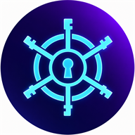

<div align="center">



# Keyhelm — Rust 密钥配置中心

聚合管理散落在服务器各个服务（docker-compose / .env / config.yaml）中的 API key 与密钥。
密钥用 AES-256-GCM 以主密钥加密后落库，通过 **REST API**（供 AI/机器人）和 **Web 界面**（供人浏览/复制）访问。

**[English](README.en.md) | 中文**

</div>

<div align="center">


[](https://github.com/limitcool/keyhelm/releases)

</div>

## 功能

- **双存储**：SQLite（默认）/ PostgreSQL（config 切换）
- **加密**：AES-256-GCM，主密钥 32 字节（env 或文件），库里只存密文
- **鉴权**：JWT（HS256）。Web 登录拿 HttpOnly cookie；程序用 API key 换 JWT
- **API**：CRUD / reveal / resolve（AI 批量取值）/ import（AI 批量写入 upsert）/ collections 分组 / 审计日志
- **Web UI**：项目树 + 搜索 + **列表直接显示明文** + 每行一键复制（clipboard 需 HTTPS/本地回环）
- **云厂商分类**：侧栏按 阿里云 / 腾讯云 / Google Cloud / Cloudflare 等分组；新增密钥时 project 下拉自动带云厂商选项
- **项目分类 + 自定义图标**：侧栏项目按 AI / 基础设施 / 认证 / 应用 / 监控 分组、可折叠；新建项目可挑 lucide 图标（存后端，开源可自定义）
- **云厂商集成**：直接调云 API 验证 key 有效性 + 探测可访问资源（阿里云 STS / 腾讯云 STS / Cloudflare / Google 服务账号）
- **导入工具**：从 `docker-stacks/*/docker-compose.yaml`、`/root/.secrets/*.env`、各服务 `config.yaml` 聚合密钥入库

## 快速开始（本地）

```bash
# 1. 复制配置
cp config.example.yaml config.yaml

# 2. 生成主密钥（或设置 KEYHELM_MASTER_KEY env）
keyhelm gen-key --out data/master.key

# 3. 首次启动会生成 admin 密码 + admin token（仅打印一次，请保存）
keyhelm serve

# 4. 用 admin token 换 JWT
curl -X POST http://127.0.0.1:8080/api/v1/token \
  -H "Content-Type: application/json" \
  -d '{"api_key":"kh_..."}'
```

## Docker 部署

预构建镜像发布在 **GitHub Container Registry**（`ghcr.io/limitcool/keyhelm:latest`），或本地构建：

```bash
# 方式一：拉取预构建镜像
docker pull ghcr.io/limitcool/keyhelm:latest

# 方式二：本地构建
docker build -t keyhelm:latest .

# 启动（docker-compose.yaml 已提供）
docker compose up -d --build

# 首次启动会打印 admin 密码 + admin token，务必保存
docker compose logs keyhelm
```

**数据持久化**：`keyhelm-data` 卷挂载到容器 `/data`，包含 SQLite 数据库、`master.key`（主密钥）、`jwt.secret`。

**主密钥注入**（推荐用 env，避免明文落盘到 compose）：

```bash
docker run -d --name keyhelm -p 8080:8080 \
  -e KEYHELM_MASTER_KEY="$(openssl rand -hex 32)" \
  -v keyhelm-data:/data \
  ghcr.io/limitcool/keyhelm:latest
```

**PostgreSQL**：设置 `KEYHELM_DB_KIND=postgres` + `KEYHELM_DB_URL`（见 `config.example.yaml`）。

**导入服务器散落密钥**（挂载只读目录）：

```bash
docker run --rm -it \
  -v /opt/docker-stacks:/opt/docker-stacks:ro \
  -v /root/.secrets:/root/.secrets:ro \
  -v keyhelm-data:/data \
  -e KEYHELM_MASTER_KEY="..." \
  keyhelm:latest import --all --dry-run
```

## CLI

```bash
keyhelm serve                # 启动服务（REST + Web）
keyhelm import --all --dry-run   # 扫描导入（--dry-run 只打印不写库）
keyhelm import --all             # 实际导入（upsert）
keyhelm bootstrap            # 重新生成 admin 凭据
keyhelm gen-key --out <path> # 生成主密钥
keyhelm gen-token --name <n> --scopes read,write,admin   # 生成 API token
```

## REST API（/api/v1，Bearer JWT）

| 端点 | 说明 |
|---|---|
| `GET /healthz` | 存活探测（免鉴权） |
| `POST /token` | API key 换取 JWT，返回 `{access_token, expires_in}` |
| `GET /secrets?project=&service=&q=&tag=&page=` | 列表（不含值，分页） |
| `POST /secrets` | 创建（重复返回 409） |
| `GET/PUT/DELETE /secrets/{id}` | 元数据 / 更新 / 删除 |
| `GET /secrets/{id}/value` | 解密 reveal（记审计） |
| `POST /resolve` | AI 批量取值：`{"items":[{"project","key_name"}]}` |
| `GET /values/{project}/{key_name}` | 单键快捷取值 |
| `POST /import` | AI 批量写入（upsert）：`[{"project","key_name","value"}]` |
| `GET /projects` | 项目树（含每个项目的自定义 `icon`） |
| `PUT /projects/{project}/icon` | 设置/清除项目 lucide 图标名 |
| `GET/POST /collections` | 分组列表 / 创建 |
| `PUT/DELETE /collections/{id}/items/{secret_id}` | 加入 / 移出分组 |
| `GET /collections/{id}/items` | 分组内密钥 |
| `POST /cloud/{provider}/verify` | 验证云厂商 key（provider: aliyun/tencent/cloudflare/google-cloud） |
| `POST /cloud/{provider}/probe` | 探测可访问资源（账号/zones/projects 等） |
| `POST /api-keys` | 创建 API key（明文仅此一次返回） |
| `DELETE /api-keys/{id}` | 吊销（JWT 即刻失效） |

**scopes**：`read`（查看/reveal）`write`（写）`admin`（api-keys/collections）。

**云厂商密钥约定**：key 放在对应 project 下（`aliyun`/`tencent`/`cloudflare`/`google-cloud`），key_name 约定：
阿里云 `ALIYUN_ACCESS_KEY_ID`+`ALIYUN_ACCESS_KEY_SECRET`、腾讯云 `TENCENT_SECRET_ID`+`TENCENT_SECRET_KEY`、
Cloudflare `CLOUDFLARE_API_TOKEN`、Google `GOOGLE_SERVICE_ACCOUNT_KEY`（服务账号 JSON）。

## AI 使用（skill）

`keyhelm` 提供一个 AI-facing skill（`.claude/skills/keyhelm/SKILL.md`）。AI 需要读写密钥、验证云厂商 key、
批量取值/写入时读该 skill 即可按约定操作。触发场景：查某个服务的 API key、存新密钥、验证 cloudflare token 等。

## 配置

`config.yaml` + `KEYHELM_*` 环境变量覆盖，见 `config.example.yaml`。

- 主密钥：`KEYHELM_MASTER_KEY`（内联值）或 `data/master.key`（文件）
- JWT secret：`KEYHELM_JWT_SECRET` 或 `data/jwt.secret`（不存在时自动生成临时值）

## 测试

```bash
cargo test   # 15 单测 + 7 集成（tower::oneshot，无需启动服务）
```

## 服务器导入示例

```bash
# 在部署机上（docker 内运行则用 docker exec）
keyhelm import --all --dry-run            # 先看会导入什么
keyhelm import --all                      # 真正导入
```
